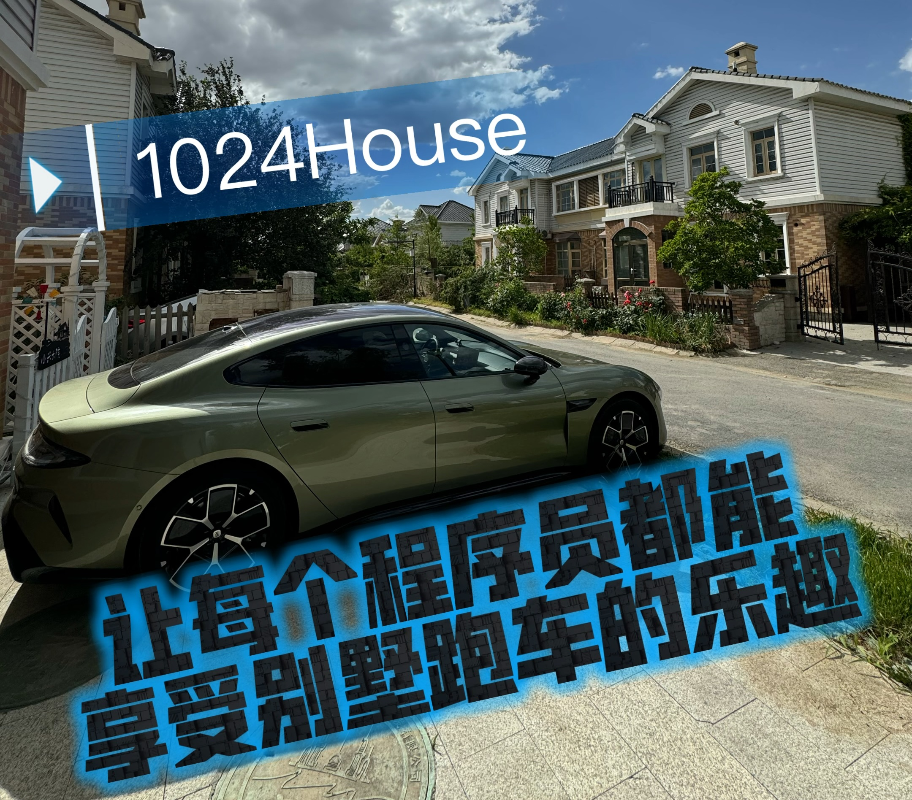

# 1024house 开源程序员客栈

让每个程序员都能享受别墅跑车的乐趣！

小米汽车接送，别墅准单人间，免费住数天，长住仅需 1024 元/月！

每人一台 34+ 英寸显示器、人体工学座椅、WiFi 7 漫游，更多惊喜等你发现。

创业分享、红警联机、庭院烧烤、救助流浪猫、辅导学弟学妹，更多活动等你一起策划。

由一个程序员为一群程序员打造，碰撞开源和商业的火花，创造价值改变世界！

## 入住要求

1. 必须为 GitHub 开源社区用户，不仅限于程序员，也欢迎运营、设计师、学生准程序员等对开源和计算机感兴趣的人。
2. 乐于分享：每个人都是有故事的人，如果你不善言辞，没关系，我们会协助每个小伙伴整理自己的经历、创意项目，举办分享会。

## 免费体验

根据开源贡献计算，采用 GitHub Achievements（成就）徽章数量，每 1 个徽章可免费住 1 天床位（也可消耗 2-3 个徽章住整个房间，适合情侣（限异性）、带朋友），欢迎在 [issue](https://github.com/1024house/1024house/issues/6) 共创探讨。

比如下图的用户有 4 个徽章，可以免费住 4 天别墅：

## 价格

根据开源贡献计算折扣，采用 GitHub Starstruck（星光璀璨）徽章等级（比如上图的用户徽章为 Starstruck x 2），欢迎在 [issue](https://github.com/1024house/1024house/issues/3) 共创探讨。

双人间床位（1 周起租） | 免费兑换 | 普通用户 | Starstruck x 1 | Starstruck x 2 | Starstruck x 3 | Starstruck x 4
-----------------|----|----------|---------------|---------------|---------------|----------------
1024（上铺） | 1 个徽章 | 360 元/周，1024 元/月（72 折） | 985 元/月 | 960 元/月 |   899 元/月    |  854 元/月（折合 29 元/天）
1024 plus（下铺） | 1 个徽章 | 480 元/周，1366 元/月（72 折）|  1280 元/月 | 1200 元/月 | 1136 元/月 | 1024 元/月（折合 34 元/天）
1024 pro（复式上层）   | 1 个徽章 | 576 元/周，1720 元/月（75 折） | 1680 元/月 | 1600 元/月 | 1536 元/月 | 1440 元/月（折合 48 元/天）
1024 pro max（复式下层） | 1 个徽章 | 800 元/周，2400 元/月（75 折） |  2304 元/月| 2160 元/月 | 1920 元/月 |   1800 元/月（折合 60 元/天）

房间（按天订） | 免费兑换 | 普通用户 | Starstruck x 1 | Starstruck x 2 | Starstruck x 3 | Starstruck x 4
----------------|---------|----------|---------------|---------------|---------------|----------------
1024 Pro（标准双人间） | 2 个徽章 | 299 元/天，2990 元/月（28 折） | 272 元/天，2720 元/月 | 256 元/天，2560 元/月 | 211 元/天，2110 元/月 |  192 元/天，1920 元/月（折合 65 元/天）
1024 Max（大床房，2 人） | 2 个徽章 |  299 元/天 | 272 元/天 | 256 元/天 |   211 元/天    |  192 元/天
1024 Ultra（套房，3 人） | 3 个徽章 |  499 元/天，4990 元/月（28 折） | 432 元/天，4320 元/月 | 384 元/天，3840 元/月 |   320 元/天，3200 元/月    |  256 元/天，2880 元/月（折合 96 元/天）

## 预订

1. 修改文件 `bookings.md`，填写自己的用户名和日期（限未来 30 天之内），发起合并请求（PR）；
2. AI 与项目维护者会根据你的账号查看开源贡献（排除文档类项目），确认免费体验天数、折扣和付款方式。
3. 项目维护者合并代码，其他人即可看到日历占用，避免冲突。
4. 周租和月租不可退款，日租房间可在前一天 18:00 之前取消（发起合并请求，以合并请求的创建时间和代码最后一次提交时间的最晚者为准）。免费体验和日租房间的取消规则相同（如未及时取消，将影响后续再订）。
5. 押金：不需要（包括免费体验和付费入住），GitHub 贡献已证明了个人信誉。

## 位置与交通

- 坐标：天津市宝坻区温泉城，距离北京 70 分钟车程或动车，距离天津市区 70 分钟车程；
- 交通：距离「宝坻南站」约 7 分钟车程，距离「宝坻站」约 30 分钟车程，如果在北京或抵达北京，请转「北京站->宝坻南站 或 宝坻站」，如果来自东北和唐山方向，请在「宝坻站」下车；
- 接送服务（宝坻南站）：每人每天一次小米汽车免费接送至宝坻南站；
- 接送服务（其他车站）：每人每周一次小米汽车免费接送至天津部分车站（武清站、天津站、天津西站、天津南站、滨海机场）；
- 附近有潮白河，别墅区也有池塘，适合钓鱼；
- 附近有大型户外温泉，价格低于百元，适合冬季体验；
- 附近有几所大学，可以邀请学弟学妹们来参加分享会和活动；

## 第一栋：米家智能馆

- 别墅户型：双拼、总高 2 层
- 环境噪音：27 分贝（安静）
- 外观风格：美式
- 装修风格：法式奶油风
- 环保级别：E0
- 床品面料：60 支希尔顿星级酒店级别床品
- WiFi 世代：7
- 智能程度：★★★★★
- 智能设备：所有灯、米家烘干洗衣机、小米路由器、小米打印机、小米空气炸锅
- 特色：小米汽车、地暖、智能马桶、钢琴、中央空调（远离外机噪音）、98 英寸电视、Xbox、K 歌、庭院烧烤、秋千

### Ultimate：准单人间（1.8 米床）

- 面积：20 平方米
- 朝向：南北通透
- 冷暖：地暖、中央空调（远离外机噪音）
- 家具：1.4 米书桌、衣帽架、衣柜、床头柜
- 家电：智能灯、小米智能窗帘、米家智能日夜卷帘（全遮光）、两个小爱音箱立体声组合
- 网络：WiFi 7

### Premium：准单人间（1.2 米床） 

- 面积：4.6 平方
- 朝向：南
- 冷暖：地暖、中央空调（远离外机噪音）
- 家具：1 米电动书桌、鞋柜
- 家电：智能灯、小爱音箱
- 网络：WiFi 7、千兆有线局域网

### EE：双床标间的一个床位（1.2 米床）

- 面积：12 平方米
- 朝向：南
- 冷暖：地暖、中央空调（远离外机噪音）
- 家具：梳妆台（可用做书桌）、衣柜
- 家电：智能灯、小米智能窗帘、小爱音箱
- 网络：WiFi 7

## 第二栋：春天即将开放

**注意：**此别墅尚未安装暖气，冬季（11 月 15 日至次年 3 月 15 日）只能开空调取暖，体验不佳，暂不开放，预计在 3 月 15 日之后开放，并进行智能化改造，感兴趣的小伙伴可提前咨询。

- 别墅户型：双拼、总高 2 层
- 装修风格：美式田园风
- 环境噪音：27 分贝（安静）
- 智能程度：★☆☆☆☆
- 特色：庭院地锅、果树采摘、浴缸

房间：

- 大床房，独立卫生间
- 大床房，共享卫生间
- 榻榻米房，共享卫生间

